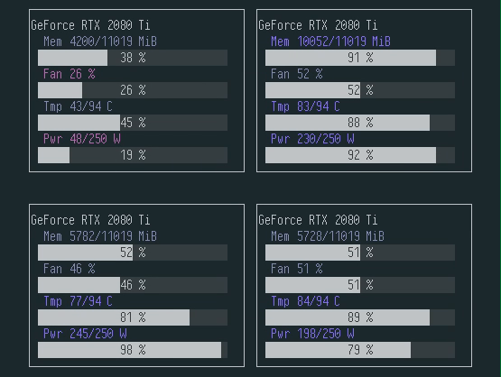

# gpu-array

---

Simple tool for visual GPU stats and process info.

## Install

No requirements other than python >= 3.6 

`pip3 install .`

## Usage

`gpu-array`

`p` cycles between stats and process information. `q` quits.

